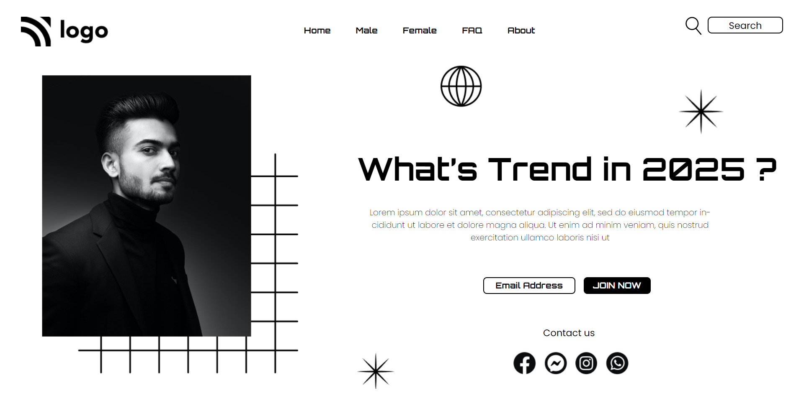

# Description
This is a sample page. The website focuses on implementing the basics of HTML and CSS to create this stunning looking webpage.
## Time taken
2 hours and 20 mins
### Things I learned
- CSS flex boxes
- Selectors for complex nested elements
### The deployed Version Link

[Street Style Landing Page](https://streetstylelp.netlify.app/)

### SnapShot of the Webpage

